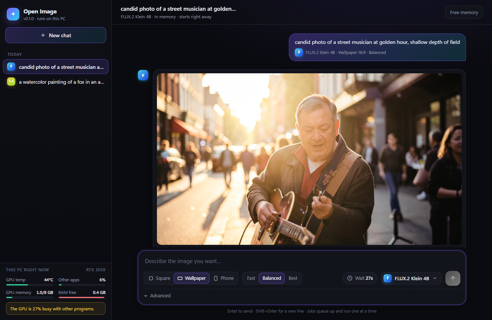

# Open Image

A local image generator with a chat interface, in its own desktop window. Pick a model, type a prompt, wait for the picture. It runs on your own GPU, shows each picture taking shape while it is drawn, keeps everything encrypted on your own disk, can lock chats and folders behind PINs, and works offline once the models are downloaded.

It is built for mid-range cards. Everything here was developed and tested on an RTX 3050 with 8 GB of VRAM and 16 GB of RAM, so the larger models are loaded in 4-bit and swapped between GPU and system memory as needed. They are slower than on a big card, but they run.



## Features

- A native window of its own, not a browser tab: no address bar, no tabs, no extensions. It only talks to the local server it started, and the page can't load anything from the internet.
- Watch the picture form. Every step the model takes is turned into a live preview, so you see the composition settle and the colours come in instead of a progress bar.
- Lock any chat or folder behind a PIN. See [Privacy](#privacy).
- Folders on the Images page. Pictures in a locked chat never show on the main Images page; pictures in a locked folder only show inside that folder.
- Pictures are saved automatically, but only ever in encrypted form. Nothing is written to disk in the clear. You can also switch saving off and keep them in memory only. See [Privacy](#privacy).
- Chat-style interface. Chats are saved on your machine, can be renamed, and remember the model last used in each.
- An Images page with everything you have made since the app started, from every chat. Filter by model, open any image for its prompt and settings, reuse them, or delete it.
- Ten models, installed and removed from inside the app. A filter shows the uncensored ones, including the ones you haven't downloaded yet.
- A wait estimate for every model before you send. It learns from your own machine: each finished image is recorded together with how busy the GPU was with other programs, free RAM and GPU temperature, and later estimates lean on the runs that happened under similar conditions. It starts from defaults measured on an RTX 3050 and gets more accurate the more you use it.
- Square, 16:9 wallpaper, and 9:16 phone shapes. Fast, balanced, and best quality presets.
- Guard rails so a heavy model can't freeze the PC: GPU memory is capped, a watchdog stops the run if the system starts paging heavily, and a hot GPU gets paused between steps.
- Jobs are queued and run one at a time. One model stays in memory and is released after 15 minutes idle.

## Requirements

- Windows 10/11 (Linux should work but is untested)
- An NVIDIA GPU with 8 GB or more of VRAM
- 16 GB of RAM recommended
- Python 3.10 or newer
- Disk space for the models you pick (see the table)

## Download (Windows)

Grab `OpenImage-<version>.exe` from the [Releases page](https://github.com/XxVoidicxX/open-image/releases) and run it. No admin rights and no Python needed.

The first run sets everything up for your Windows account: it downloads a private copy of Python and the AI libraries (PyTorch with CUDA and friends, about 4 GB) into `%LOCALAPPDATA%\OpenImage`, adds Open Image to the Start menu and the desktop, and opens the app. That takes a few minutes on a fast connection. After that it starts straight away. Running a newer release later updates it in place and keeps your chats, pictures and models.

The exe isn't code-signed, so Windows SmartScreen may warn the first time; choose More info, then Run anyway. To remove Open Image, delete `%LOCALAPPDATA%\OpenImage` (the program), the Start menu and desktop shortcuts, and `%USERPROFILE%\OpenImage` (your chats, pictures and models).

To build the exe yourself: install [uv](https://docs.astral.sh/uv/) and run `python packaging/build.py`. It lands in `dist/`.

## Install from source

```
git clone https://github.com/XxVoidicxX/open-image
cd open-image
python -m venv .venv
.venv\Scripts\activate
pip install torch --index-url https://download.pytorch.org/whl/cu128
pip install -r requirements.txt
```

Start the app:

```
python -m open_image
```

On Windows you can also double-click `run.bat`. The app opens in its own window. It uses the WebView2 runtime that ships with Windows 10/11 and Edge; no browser needs to be open. Starting it again while it is running just brings the window to the front.

For development there is `python -m open_image serve --no-window`, which only runs the local server. It prints nothing and answers nothing without the session secret (set `OPEN_IMAGE_TOKEN` to choose one and open `http://127.0.0.1:7860/?t=<secret>`).

Models are installed from the app: open the model picker at the bottom right of the chat box and choose Manage models. You can also use the command line:

```
python -m open_image models
python -m open_image download flux2-klein-4b z-image-turbo
```

## Models

| Model | Id | Download | Notes |
|---|---|---|---|
| Qwen Image 2.1 | `qwen-image-21` | ~31 GB | Best quality and text. Slowest, reloads for every image |
| FLUX.2 Klein 4B | `flux2-klein-4b` | ~15 GB | Fast, photorealistic |
| Z-Image Turbo | `z-image-turbo` | ~33 GB | Fast all-rounder |
| Chroma HD | `chroma1-hd` | ~26 GB | FLUX-style, uncensored |
| Pony Diffusion V6 XL | `pony-v6-xl` | ~7 GB | Stylized and anime, tag prompts, uncensored |
| Prefect Pony XL v5 | `prefect-pony-xl` | ~6.5 GB | Pony-based, cleaner anatomy, uncensored |
| WAI Illustrious v14 | `wai-illustrious` | ~7 GB | Anime illustration, tag prompts, uncensored |
| NoobAI XL 1.1 | `noobai-xl` | ~6.5 GB | Illustrious-based anime, huge tag set, uncensored |
| Stable Diffusion XL 1.0 | `sdxl-base` | ~7 GB | The classic |
| Stable Diffusion 1.5 | `sd15` | ~3 GB | Tiny and very fast |

Models come from Hugging Face and each keeps its own license. Check the model page before using output commercially.

"Uncensored" here means the model has no built-in content filter and was trained on a broad range of material. Open Image doesn't add a filter of its own, so what you make with them is up to you.

Typical times on an RTX 3050 8 GB at the default size, balanced quality: Stable Diffusion 1.5 about 20 s, SDXL and the anime models about 35 s, FLUX.2 Klein about 15 s once loaded, Z-Image Turbo about 45 s, Chroma HD about 4 min, Qwen Image 2.1 about 3 min plus about a minute of loading.

## Privacy

A picture is never written to disk in the clear. It goes from the model process to the app over a pipe, is sealed with AES-256-GCM (fresh random nonce, bound to the picture's id), and only then stored. The window gets it decrypted on request, with `Cache-Control: no-store`, and runs in private mode so nothing is cached.

- **Saving on (default):** sealed pictures are kept in `data/pictures`. Pictures from ordinary chats are sealed with the app key, a random 256-bit key made once on first run and stored wrapped by Windows DPAPI, so the key file is useless on another PC or Windows account. Pictures in a locked chat or folder are sealed with that item's own key instead, so without the PIN they stay unreadable even to the app.
- **Saving off:** pictures stay sealed in memory only and are gone when the app closes. Turning it off moves everything already saved back into memory and deletes the files.
- Live previews exist only in memory and are dropped as soon as the picture is finished.
- The server only answers requests addressed to `127.0.0.1` or `localhost`, and only to the app window: every launch makes a new random secret that the window carries as a cookie. Other programs, browsers and scripts on the PC get a 401.
- The page has a content security policy that blocks any request to another site, and model workers run with the Hugging Face libraries in offline mode. The only time the app touches the network is when you press Install on a model.
- Use Save on an image to put a normal copy in your downloads folder; that is the only way a picture becomes a readable file.

What this does not cover: anything running as your Windows user can ask DPAPI to unwrap the app key, so pictures in ordinary chats are protected against copies of the disk and other accounts, not against software running as you. Lock the chats that matter. The operating system can also move memory into its page file or hibernation file, which the app cannot prevent; turn on BitLocker if that matters to you. Screenshots and files you save yourself are outside the app's control.

Older versions saved pictures in an `images` folder. If the app finds files there it offers to delete them.

### Locks

Any chat or folder can be locked from the lock button. Locking gives it its own random 256-bit key. Its title, prompts, settings and pictures are encrypted under that key. The key is stored wrapped by a key derived from your PIN (scrypt), and nowhere else. While it is locked:

- the chat's text on disk is ciphertext, and only the label you chose is visible;
- its pictures are stored sealed under its own key, so the app cannot decrypt them either;
- every API call that would reveal it (`/api/state`, pictures, downloads, rename, generate) answers 423 until the PIN is entered;
- repeated wrong PINs are slowed down, and a locked chat does not appear on the Images page or in its counts.

Opening a locked chat keeps its key in memory until you lock it again or close the app. Pictures from a locked chat can only be filed into locked folders. A picture moved into a locked folder leaves its chat and only exists in that folder.

The **master PIN** (Privacy & locks) opens everything at once. Each locked chat or folder also holds its key encrypted to the master public key, so the master PIN can open it without knowing its own PIN, and unlocking with the master PIN keeps every one of them open for the session. Locked items that predate the master PIN get their master wrap the first time they are opened with their own PIN.

There is no recovery. If you forget a PIN, what it protects is gone. Short PINs can be brute-forced offline by someone who copies your data folder, so use six or more characters if that matters.

## Where things are stored

Everything lives under one folder, `~/OpenImage` by default:

```
models/   downloaded models
data/     chats, prompt history, folders, settings, timing data, logs
data/locked/   encrypted files for locked chats and folders
data/pictures/ sealed pictures (when saving is on)
data/app.key   the app key, wrapped by Windows DPAPI
```

Set `OPEN_IMAGE_HOME` to use a different folder, for example a bigger drive. `OPEN_IMAGE_PORT` changes the port.

## How it works

The web server (FastAPI) never loads a model itself. Each model runs in a separate worker process that talks to the server over a pipe. If a model runs out of memory or the guard stops it, only that worker dies, and the app reports what happened. Model downloads also run as their own process, so they can be cancelled and resumed.

- `open_image/catalog.py` is the model list: names, settings, download rules.
- `open_image/engines.py` has the loaders for each model family.
- `open_image/guard.py` holds the memory and temperature limits.
- `open_image/timing.py` and `resources.py` produce the wait estimates.
- `open_image/installs.py` installs and removes models.
- `open_image/jobs.py` is the queue, chat storage, and worker management.
- `open_image/preview.py` turns each denoising step into a live preview. SDXL and Flux-family models use a linear latent-to-colour projection fitted on real pictures; other models fall back to a false-colour view of the strongest latent components.
- `open_image/vault.py` seals and stores pictures, `keystore.py` holds the app key; `locks.py` and `library.py` do PIN locks, folders and the master PIN.

To add a model, add an entry to `catalog.py` and, if it is a new architecture, a loader in `engines.py`.

## Status

Version 0.6. Not done yet: image-to-image and editing, and testing on Linux.

## License

MIT. See `LICENSE`.
